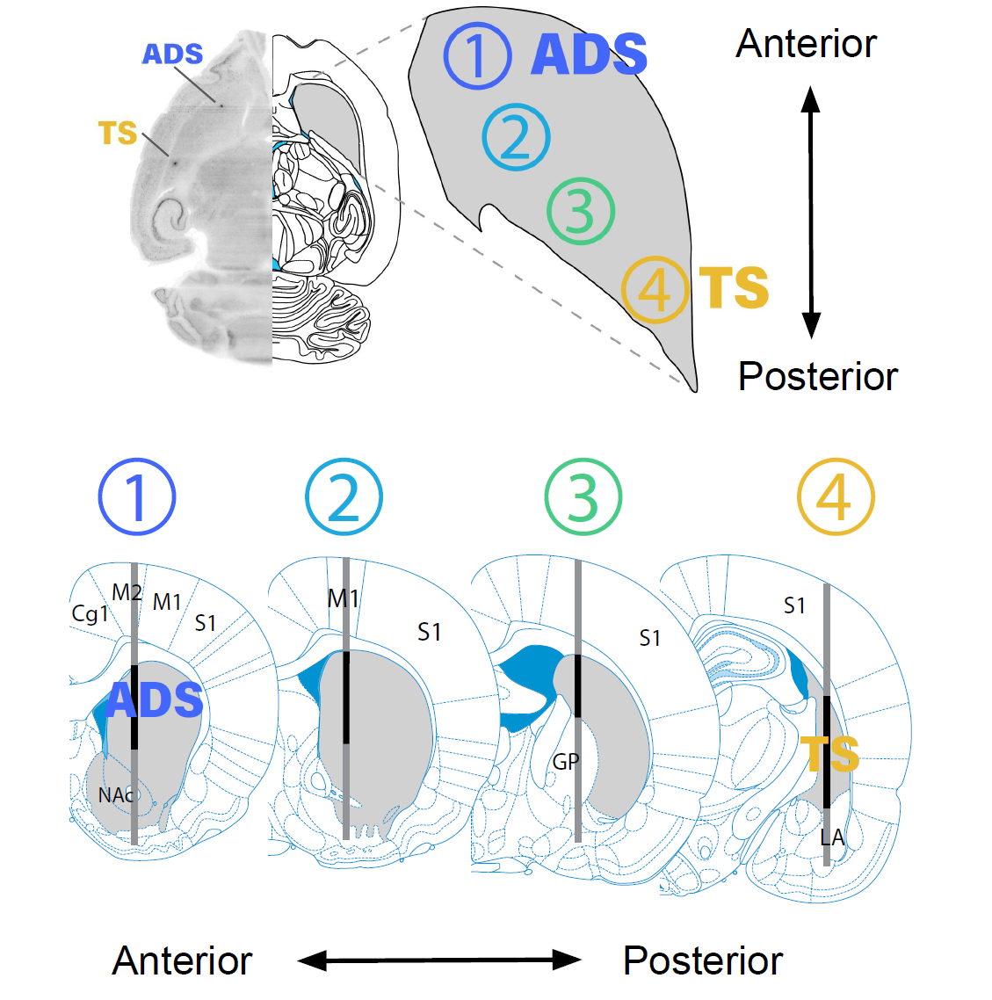

# __adrian_striatum_analysis__
###### *This repository describes the databset of chronic rat Neuropixels recordings performed by Adrian Bondy in various striatal subregions and a Matlab interface for the dataset*

### What dataset are we talking about?
The dataset consists of 81 Neuropixels recording sessions from probes implanted chronically in 12 rats performing the Poisson Clicks task. The recordings were performed to target 4 sites spanning the AP axis of dorsal striatum. Over 14,000 cells were recorded, of which around 10,000 were in the target striatal regions (i.e. the black regions in the picture below). Several rats were implanted with multiple probes, and recording sessions from the same date correspond to simultaneous recordings from those sets of probes. Times and trial numbers in such files are identical. For more information on the procedure for chronic implantation of Neuropixels probes in rats, see [Luo*, Bondy* et al. (2020). eLife](https://elifesciences.org/articles/59716)

###### Anatomical overview of the recordings. Four sites spanning the anteroposterior axis of striatum were chosen, going from ADS (anterior dorsal striatum) to TS (tail of the striatum). Black regions of each probe shank correspond to dorsal striatum, i.e. the region of primary interest. Also shown is a horizontal slice through a cleared brain volume of a rat with two probes simultaneously implanted in ADS and TS. Fluorescent marks indicate the probes locations.

### How do I see a list of what is in the dataset (i.e. cells, sessions, rats)?
There are two ways you can see what's in the dataset, without loading in individual files:
  1. In Matlab, run `sessions_table = load_sessions_table()` to load a table with rows corresponding to recording sessions in the database. Columns provide session-level information, such as the rat, recording date, recording location, behavioral performance, the path to the actual datafile, etc.
  2. In Matlab, run `cells_table = load_cells_table()` to load a table with a row for each individual cell in the database, and columns describing features of those cells. Note that this table does not contain spike times but is useful for providing an overview of the properties of the cells in the database, for example the 3-D anatomical location of the entire database of recorded cells, the distribution of waveform properties across the dataset, or the contribution to the database of particular rats.

  *N.B.: The above functions really just load into Matlab CSV files located in the main data directory (i.e. `my_path` below), which you can view directly using your method of choice, i.e. Julia, Google Sheets, etc. They are called `sessions_table.csv` and `cells_table.csv` respectively.*

### Where is the data?

  The actual data resides in `\\bucket.pni.princeton.edu\brody\abondy\adrian_striatum_analysis`. To work locally for faster database access, copy this folder to some local directory `my_path` and then edit the file `get_parameters.m` such that the variable `pc_data_path` is set to `my_path`, i.e.:  
  &nbsp;&nbsp;&nbsp;&nbsp;&nbsp;&nbsp;&nbsp;
          replace  
          &nbsp;&nbsp;&nbsp;&nbsp;&nbsp;&nbsp;&nbsp;`P.pc_data_path = fullfile('X:','abondy','adrian_striatum_analysis');`  
          &nbsp;&nbsp;&nbsp;&nbsp;&nbsp;&nbsp;&nbsp;with 
          &nbsp;&nbsp;&nbsp;&nbsp;&nbsp;&nbsp;&nbsp;`P.pc_data_path = my_path;`  
          &nbsp;&nbsp;&nbsp;&nbsp;&nbsp;&nbsp;&nbsp;Although note that you will need to regenerate the `sessions_table` and `cells_table` if you change the location of the data, by running: `make_cells_table()` and `make_sessions_table()` in Matlab.

  Within this top-level directory, the datafiles for each sessions, which contain the actual spike times and behavioral data, are located in `cells/[recording_name]/[recording_name]_Cells.mat`. 

### Datafile format
Each datafile (sometimes called a "Cells" file) is a Matlab structure with a large number of fields providing information about the spiking and behavioral data of the recordings session. Each cells file is defined by a unique identifier called its "recording_name" which usually takes the form [ratname]_[YYYY]_[MM]_[DD]. When multiple sessions were acquired from the same rat on the same day (for example when two probes were recorded simultaneously) then an additional suffix is added to the recording name. To load in a specific cells file, you can run `cells_file = load_cells_file(recording_name)`. 
###### _Some key fields in a cells file include:_
- __spike_time_s__ : a structure with fields for each task event (i.e. cpoke_in, cpoke_out, left_clicks, etc.), specifying the spike times for each trial and cell, in units of seconds relative to the task event
- __Trials__ : a structure with information about the task and behavior on each of the N trials. Key fields include:
  - *stateTimes* : a structure with fields of length N for each task event, giving the times according to the BControl clock, when they occurred on each trial.
  - *is_hit* : a boolean vector of length N stating whether reward was delivered on each trial.
  - *violated* : a boolean vector of length N stating whether the animal broke fixation on each trial.
  - *poked_R* : a boolean vector of length N indicating the animal's choice on each trial.
  - *gamma* : a vector of length N stating what the signal level was on each trial (the log of the ratio of right / left click generative rates)
  - *trial_type* : a character vector of length N indicating the type of trial ("a" = accumulation, "f" = free choice, "s" = side LED)      
  - *stim_dur_s* : a vector of length N stating the stimulus durations of each trial
  - *leftBups*,*rightBups* : a cell array of length N listing the times (in seconds relative to stimulus onset) of the left and right clicks on each trial
  - *laser* : a structure with information about the laser stimulation parameters on each trial.
- __rat__ : rat name
- __sessid__ : unique behavioral session ID
- __electrode__ : a vector specifying the electrode on which each neuron was recorded (1 being closest to the shank tip)
- __nTrials__ : the number of completed behavioral trials
- __laser_power_mW__ : the laser power in mW
- __session_notes__ : a string of comments, taken from the Neuropixels recording log for that session
- __D2Phototagging__ : a scalar boolean, indicating whether optogenetic tagging of D2 neurons was performed on that session
- __penetration__ : a structure with information about the probe insertion coordinates, insertion depth and angle
- __probe_serial__ : the serial number of the Neuropixels probe used
- __AP__ : a vector specifying the anteroposterior location of each cell, relative to Bregma (in mm)
- __ML__ : a vector specifying the mediolateral location of each cell, relative to the midline (in mm)
- __DV__ : a vector specifying the depth of each cell below the brain surface (in mm)
- __regions__ : a vector specifying the region index of each cell (see penetration.regions for info on what these indices correspond to)
- __ks_good__ : a boolean vector indicating whether the refractory period indicates this cell is a single unit (see methods of Luo\*, Bondy\* et al. (2020) for definition of this metric)
- __days_implanted__ : days elapsed since the probe implantation
- __n_clusters__ : the number of cells in the recording (some of which may be multi-unit, see "ks_good")
- __waveform__ : a structure with information about each cell's mean waveform shape (this field is missing for some older sessions)
- __is_in_dorsal_striatum__ : a Boolean vector specifying whether or not each cells was in dorsal striatum. For most analyses we are interested in, we confine analysis to cells where this value is TRUE. Cells for which this value is 0 may include cells in cortex, ventral striatum, or other areas incidentally recorded on the probe. The "regions" field provides more thorough information on what brain region each cell was in.
- __ap_group__ : a value from 1 to 4 specifying which of the 4 target sites this recording corresponds to.

### Dependencies
There are a number of dependencies in this repository on other Brody Lab repositories, namely `npx-utils` and `labwide_pbups_analysis`.
